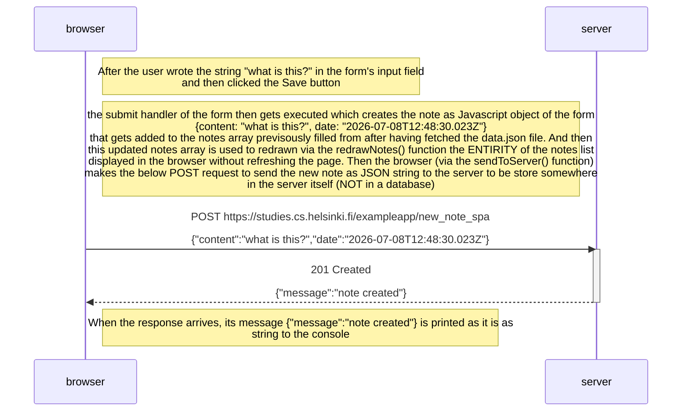

```mermaid
sequenceDiagram
    participant browser
    participant server

    Note right of browser: After the user wrote the string "what is this?" in the form's input field<br/>and then clicked the Save button

    Note right of browser: the submit handler of the form then gets executed which creates the note as Javascript object of the form <br/>{content: "what is this?", date: "2026-07-08T12:48:30.023Z"}<br/>that gets added to the notes array previsously filled from after having fetched the data.json file. And then<br/>this updated notes array is used to redrawn via the redrawNotes() function the ENTIRITY of the notes list<br/>displayed in the browser without refreshing the page. Then the browser (via the sendToServer() function)<br/>makes the below POST request to send the new note as JSON string to the server to be store somewhere<br/>in the server itself (NOT in a database)

    browser->>server: POST https://studies.cs.helsinki.fi/exampleapp/new_note_spa<br/><br/>{"content":"what is this?","date":"2026-07-08T12:48:30.023Z"}
    activate server
    server-->>browser: 201 Created<br/><br/>{"message":"note created"}
    deactivate server

    Note right of browser: When the response arrives, its message {"message":"note created"} is printed as it is as<br/>string to the console
```
